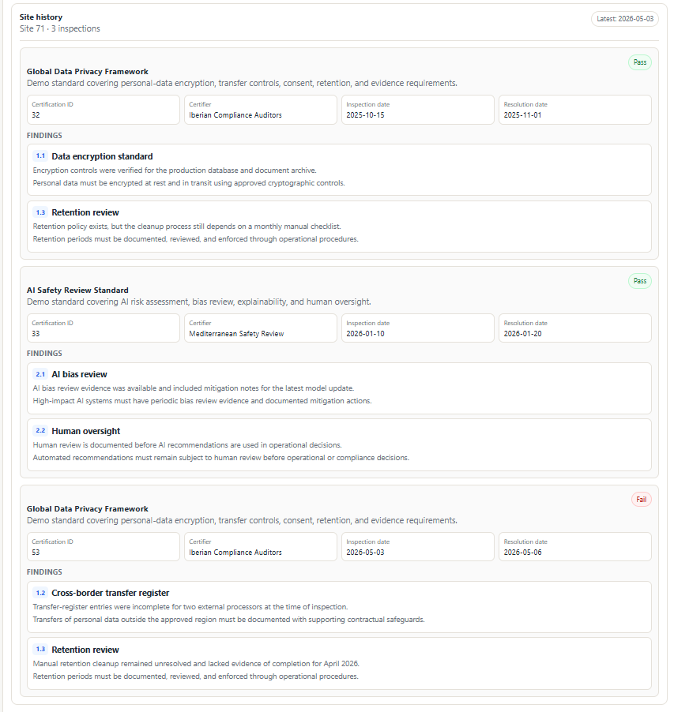
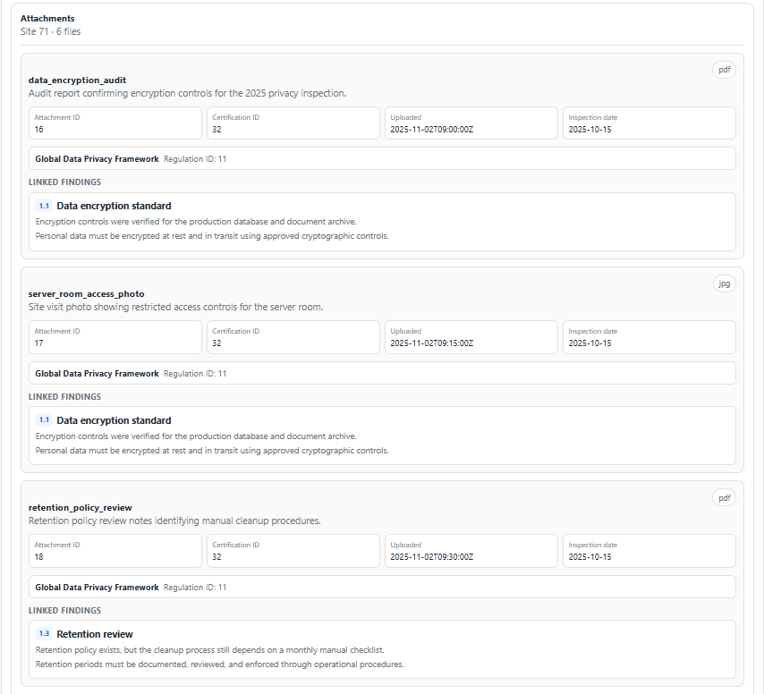
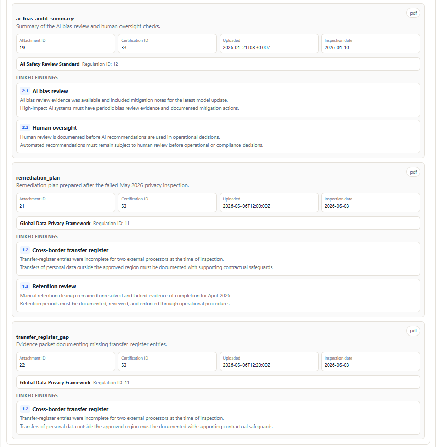

<!-- docs:start -->
# Compliance

Inspection and compliance management system with a FastAPI backend, relational
domain model, evidence attachments, archive/restore workflows, role-based
authorization, and AI-assisted site-history analysis.

This is a portfolio MVP. It is designed for local demos, technical review, and
experimentation with database-backed API design and human-reviewed AI output.
It is not production-ready for real compliance data without additional security,
privacy, deployment, and operational work.

[](https://github.com/elliottbache/compliance/actions/workflows/ci.yaml)
[](https://codecov.io/github/elliottbache/compliance)
[](https://github.com/elliottbache/compliance/releases)
[](https://polyformproject.org/licenses/noncommercial/1.0.0/)


## What This Project Demonstrates

- FastAPI route design with typed Pydantic request and response schemas.
- SQLAlchemy 2.0 ORM modeling for a compliance inspection domain.
- Alembic migration history for schema changes.
- Service-layer business logic separated from route handlers.
- Structured conflict handling for missing parents, uniqueness conflicts,
  archive state, upload problems, and AI failures.
- Evidence attachment metadata, upload, download, archive, and restore flows.
- Archive/restore behavior for main domain records.
- JWT-based authentication with role-based authorization.
- Hierarchical roles: `admin > inspector > reviewer > viewer`.
- AI site-history analysis with deterministic mock mode and optional Anthropic
  mode.
- Backend, service, database, auth, and LLM tests with pytest.
- A small React/Vite frontend that exercises the demo workflow.

## Current Status

The backend is the strongest part of the project. It has broad route, service,
database, auth, and LLM test coverage. The frontend is intentionally lightweight
and exists to demonstrate site history, attachment loading, AI analysis, and
Markdown generation. The auth layer is functional but still demo-oriented:
password creation is not yet a full user-management workflow, and production
security hardening remains future work.

AI output is always treated as a draft for human review. It should not be used
as an official compliance decision.

## Demo

### Installation


### Usage


Demo screenshots live in `examples/demo/results/`:







Sample generated Markdown:

```text
examples/demo/results/site-71-analysis.md
```

## Repository Layout

```text
backend/
├── migrations/              Alembic migration history
├── src/compliance/
│   ├── api/                 FastAPI app, route modules, dependencies
│   ├── auth/                JWT, password, current-user, and role helpers
│   ├── db/                  SQLAlchemy models and DB session access
│   ├── llm/                 Anthropic adapter and structured output schemas
│   ├── services/            Business logic and query composition
│   └── schemas.py           Cross-service output schemas
└── tests/                   Backend test suite

frontend/                    React + TypeScript + Vite demo UI
docs/                        Sphinx documentation
examples/demo/               Seed data, fake evidence files, screenshots
docker/                      Backend/frontend Dockerfiles and env template
docker-compose.yaml          Local Postgres + backend + frontend stack
```

For a route-by-route overview of backend request flow, see
[Backend Code Flow](docs/backend-flow.md).

## Domain Model

The core records are:

- `Client`: organization that owns one or more sites.
- `Site`: physical location that receives inspections or certifications.
- `Certifier`: organization accrediting a certification.
- `Regulation`: compliance framework being checked.
- `Rule`: individual requirement within a regulation.
- `Certification`: inspection/certification event for one site.
- `Finding`: issue or observation tied to a certification and rule.
- `Attachment`: evidence file metadata and optional stored file.
- `FindingAttachment`: link between findings and supporting attachments.
- `User`: authenticated application user with a role and active status.

The system is centered around site history. A site history response gathers the
site, certifications, findings, rules, regulations, certifiers, clients, and
linked attachment context needed to review previous inspections before a new
visit.

## API Surface

The backend exposes route groups for:

- `/auth`: OAuth2 password login and bearer-token creation.
- `/users`: list users and create users.
- `/clients`: list, create, archive, and restore clients.
- `/sites`: list, create, archive, restore, load history, load attachments, and
  request AI analysis.
- `/certifiers`: list, create, archive, and restore certifiers.
- `/regulations`: list, create, archive, and restore regulations.
- `/rules`: list, create, archive, and restore rules.
- `/certifications`: list, create, archive, and restore certifications.
- `/findings`: list, create, archive, and restore findings.
- `/attachments`: list metadata, create metadata, upload files, download files,
  archive, and restore attachments.

FastAPI interactive docs are available locally at:

```text
http://localhost:8000/docs
```

## Authentication And Authorization

Authentication uses FastAPI's OAuth2 password flow and signed JWT bearer tokens.
The token subject is the user's email address. Current-user resolution loads the
credential-bearing database user internally, then returns a public `UserOut`
schema so route handlers do not receive `hashed_password`.

User schemas are intentionally separated:

- `UserCreate`: input for creating users; includes `full_name`, `email`,
  plaintext `password`, `role`, and `is_active`.
- `UserOut`: public user data returned to API callers and route dependencies.
- `UserInDB`: internal credential-bearing schema; includes `hashed_password` and
  should stay inside authentication code.

Roles are hierarchical:

```text
admin > inspector > reviewer > viewer
```

Authorization dependencies use a minimum role:

```python
Depends(require_role(Role.ADMIN))
```

That means a route requiring `Role.REVIEWER` allows reviewers, inspectors, and
admins, but rejects viewers.

Current protected behavior:

- Read/list endpoints require at least `Role.VIEWER`.
- Creating users, clients, sites, certifiers, regulations, rules, and
  certifications requires `Role.ADMIN`.
- Archiving and restoring clients, sites, certifiers, regulations, rules, and
  certifications requires `Role.ADMIN`.
- Creating, uploading, archiving, and restoring attachments requires at least
  `Role.INSPECTOR` and verifies that the certification belongs to the current
  inspector.
- Creating, archiving, and restoring findings requires at least
  `Role.INSPECTOR` and verifies that the certification belongs to the current
  inspector.
- Requesting site analysis requires at least `Role.REVIEWER`.
- User passwords are accepted only at creation time and stored as hashes.

Production note: the authentication layer is functional, but production
deployments still need a first-admin bootstrap procedure, password reset/change
workflow, password policy, login throttling or lockout, and operational
procedures for rotating secrets.

## Archive Policy

Main domain records support archive and restore through `archived_at` and
`archive_reason`.

- List endpoints exclude archived records by default.
- List endpoints expose `include_archived=true`.
- Exact detail/history endpoints may return archived records where that is
  useful for audit-trail access.
- Archive and restore operations are idempotent.
- Archive and restore do not cascade to child records.
- Child visibility is handled by read queries where implemented.
- `FindingAttachment` rows are link rows and are not archived independently.

## Attachments

Attachment records can be created before a file is uploaded. In that state,
`file_path` is `null`, and the frontend displays missing file path/upload date
values as `--`.

The upload/download flow is intentionally split:

1. Create attachment metadata.
2. Upload a file for an attachment.
3. Download the stored file by attachment ID.
4. Archive or restore the attachment metadata when needed.

Local demo files should be copied into:

```text
backend/storage/attachments/
```

## AI Site Analysis

The site-analysis service can run in two modes:

- `AI_MODE=mock`: deterministic offline analysis for demos and tests.
- `AI_MODE=anthropic`: live Anthropic-backed analysis with structured response
  validation.

The Anthropic adapter:

- sends a schema-constrained site-history request;
- validates the response against Pydantic `SiteAnalysis` models;
- checks evidence references against source records;
- separates provider/API failures from terminal model stop reasons;
- supports one schema-repair attempt for invalid JSON or invalid structured
  output;
- raises typed errors for refusal, max-token, context-window, tool-use, and
  pause-turn stop reasons.

AI analysis is a review aid only. Generated Markdown should be checked by a
person and traced back to source records before any operational decision.

## Docker Quickstart And Tutorial

Use this path when you want to install the project quickly, confirm the stack
works, and run the demo tutorial. Docker Compose starts PostgreSQL, the backend,
and the frontend together.

Clone the repo:

```bash
git clone https://github.com/elliottbache/compliance.git
cd compliance
```

Create a Docker environment file:

```bash
cp docker/.env.example docker/.env
```

For offline demos, keep:

```ini
AI_MODE=mock
ANTHROPIC_API_KEY=
SECRET_KEY=replace_with_a_long_random_secret_for_local_auth
ALGORITHM=HS256
ACCESS_TOKEN_EXPIRE_MINUTES=30
```

For live Anthropic analysis, set:

```ini
AI_MODE=anthropic
ANTHROPIC_API_KEY=your_anthropic_api_key_here
SECRET_KEY=replace_with_a_long_random_secret_for_local_auth
ALGORITHM=HS256
ACCESS_TOKEN_EXPIRE_MINUTES=30
```

Start the stack:

```bash
docker compose --env-file docker/.env up -d --build
```

Open:

```text
Frontend: http://localhost:5173
Backend:  http://localhost:8000
Docs:     http://localhost:8000/docs
```

If your user is not in the Docker group:

```bash
sudo usermod -aG docker "$USER"
newgrp docker
```

### Tutorial Data

The demo dataset centers on:

```text
Site ID: 71
```

Copy fake attachment files into backend runtime storage:

```bash
mkdir -p backend/storage/attachments
cp examples/demo/attachments/* backend/storage/attachments/
```

With Docker Compose running, load the seed data:

```bash
docker compose --env-file docker/.env exec -T postgres psql -U postgres -d compliance_db < examples/demo/seed_demo_data.sql
```

The backend container runs Alembic migrations during startup.

Then open the frontend and run:

```text
Load History
Load Attachments
Run AI Analysis
Generate Markdown
Download Markdown
```

The seed file is for quickstart/tutorial use only. It truncates demo tables
before inserting records, so do not run it against a database containing real
data.

See [Demo Documentation](examples/demo/README.md) for more detail.

## Local Development

Use this path for day-to-day backend and frontend work without Docker. It
assumes PostgreSQL is installed and running on the host machine.

### Backend

Create a local backend environment file:

```bash
cp backend/.env.example backend/.env
```

Default local values:

```ini
APP_ENV=development
POSTGRES_USER=postgres
POSTGRES_PASSWORD=postgres
POSTGRES_DB=compliance_db
POSTGRES_HOST=localhost
POSTGRES_PORT=5432
ATTACHMENTS_DIR=/path/to/your/compliance/folder/backend/storage/attachments
CORS_ORIGINS=http://localhost:5173
AI_MODE=mock
ANTHROPIC_API_KEY=
SECRET_KEY=replace_with_a_long_random_secret_for_local_auth
ALGORITHM=HS256
ACCESS_TOKEN_EXPIRE_MINUTES=30
```

Install the project and development dependencies:

```bash
python -m pip install -U pip
pip install -e .[dev]
```

Start local PostgreSQL and create the development database. On Ubuntu/WSL with
the distro PostgreSQL package, one common setup is:

```bash
sudo service postgresql start
sudo -u postgres psql -c "ALTER USER postgres WITH PASSWORD 'postgres';"
sudo -u postgres createdb -O postgres compliance_db
```

If `compliance_db` already exists, keep the existing database and continue. The
backend runs from the host during local development, so `backend/.env` should
keep `POSTGRES_HOST=localhost`.

Run migrations from the repository root:

```bash
alembic -c backend/alembic.ini upgrade head
```

Check the applied migration revision when needed:

```bash
alembic -c backend/alembic.ini current
alembic -c backend/alembic.ini heads
```

When changing the database schema during development:

1. Update the SQLAlchemy models.
2. Generate an Alembic migration:

   ```bash
   alembic -c backend/alembic.ini revision --autogenerate -m "describe schema change"
   ```

3. Review the generated migration before running it. Confirm that it contains
   only intentional table, column, index, constraint, and data changes.
4. Apply the migration locally:

   ```bash
   alembic -c backend/alembic.ini upgrade head
   ```

5. Run the relevant backend tests:

   ```bash
   pytest --no-cov
   ```

Start the backend:

```bash
fastapi dev backend/src/compliance/api/main.py
```

### Frontend

```bash
cd frontend
npm install
cp .env.example .env
npm run dev
```

`frontend/.env` should normally contain:

```ini
VITE_API_BASE_URL=http://localhost:8000
```

Open:

```text
http://localhost:5173
```

## Production Docker Deployment

Use this path for a production-style Docker deployment, not for routine local
development. Production deployments should use strong secrets, persistent
storage, backups, and an explicit migration step.

Create a deployment environment file from the Docker template:

```bash
cp docker/.env.example docker/.env
```

Before deploying, replace all development defaults in `docker/.env`, especially:

```ini
APP_ENV=production
POSTGRES_PASSWORD=replace_with_a_strong_database_password
ATTACHMENTS_DIR=/persistent/path/to/attachments
CORS_ORIGINS=https://your-production-origin.example
SECRET_KEY=replace_with_a_long_random_secret
AI_MODE=anthropic
ANTHROPIC_API_KEY=replace_with_provider_key
```

For live Anthropic analysis, set `AI_MODE=anthropic` and provide
`ANTHROPIC_API_KEY`. Only enable live AI mode when the deployment owner has approved outbound provider calls for the data being analyzed.  Be sure to contact Anthropic to enable a Zero Data Retention agreement if you handle sensitive client data.  If handling health data, make sure to sign a Business Associate Agreement. 

When `APP_ENV` is `staging` or `production`, the backend rejects unsafe
development defaults at startup. The PostgreSQL password must not be
`postgres`, `AI_MODE` must not be `mock`, `ATTACHMENTS_DIR` must not resolve to
the current working directory, and `CORS_ORIGINS` must not be localhost or `*`.

The production upgrade flow is:

1. Back up the database.
2. Back up the attachment storage directory or volume.
3. Run Alembic migrations against the deployment database.
4. Start or restart the application containers.
5. Check `/health/ready` after the readiness endpoint is available.

Startup checks verify that the database is at Alembic head and that SQLAlchemy models match the migration history. Staging and production startup fails if those
checks fail; run the explicit migration command below after taking backups.
Development startup may apply existing migrations automatically, but model
changes still require a generated and reviewed migration.

Example commands for the current Compose setup:

```bash
docker compose --env-file docker/.env up -d postgres
docker compose --env-file docker/.env exec -T postgres pg_dump -U postgres -d compliance_db > compliance_db_backup.sql
docker compose --env-file docker/.env run --rm backend python -m alembic -c backend/alembic.ini upgrade head
docker compose --env-file docker/.env up -d --build
curl -f http://localhost:8000/health/ready
```

Until `/health/ready` is implemented, confirm the migration revision with:

```bash
docker compose --env-file docker/.env exec backend python -m alembic -c backend/alembic.ini current
```

Do not load tutorial seed data into a production database.

## Configuration

### Runtime Environment

```ini
APP_ENV=development
```

`APP_ENV` must be one of `development`, `staging`, or `production`.
Development allows local defaults for quick setup. Staging and production
enable startup validation that rejects unsafe defaults for database password,
AI mode, attachment storage, and CORS origins.

### Database

The backend builds its database URL from:

```ini
POSTGRES_USER
POSTGRES_PASSWORD
POSTGRES_DB
POSTGRES_HOST
POSTGRES_PORT
```

Environment variables supplied by Docker or the shell are preserved. `.env`
files are loaded with `override=False`.

### Attachment Storage

```ini
ATTACHMENTS_DIR=/path/to/attachments
```

Uploaded attachment files are stored under `ATTACHMENTS_DIR`. For local
development this can point at `backend/storage/attachments`. For staging and
production, use a persistent directory or mounted volume that is included in
backup and restore procedures.

### CORS

```ini
CORS_ORIGINS=http://localhost:5173
```

`CORS_ORIGINS` defines the frontend origins allowed to call the backend. Local
development normally uses the Vite origin shown above. Staging and production
must use explicit deployed frontend origins, not localhost or `*`.

### Auth

JWT settings are read from environment variables:

```ini
SECRET_KEY
ALGORITHM
ACCESS_TOKEN_EXPIRE_MINUTES
```

`ALGORITHM` defaults to `HS256`; `ACCESS_TOKEN_EXPIRE_MINUTES` defaults to `30`.
`SECRET_KEY` is required for token creation and decoding.

### AI

```ini
AI_MODE=mock
ANTHROPIC_API_KEY=
```

Use `AI_MODE=anthropic` and a valid `ANTHROPIC_API_KEY` for live provider calls.
Mock mode is the safer default for local demos and automated tests.

## Testing And Quality

Backend tests:

```bash
pytest --no-cov
```

Targeted backend examples:

```bash
pytest --no-cov backend/tests/auth
pytest --no-cov backend/tests/services
pytest --no-cov backend/tests/db
pytest --no-cov backend/tests/llm
```

Python linting:

```bash
ruff check backend/src backend/tests
```

Frontend checks:

```bash
cd frontend
npm run build
npm run test
npm run test:e2e
```

Project-level pytest configuration includes coverage settings for CI. During
local focused development, `--no-cov` is useful to avoid unrelated coverage
failures while iterating on a small area.

Remove generated caches and local build artifacts with:

```bash
make clean
```

This cleans Python caches, coverage output, Sphinx build output, frontend build
and Playwright artifacts, and Windows `Zone.Identifier` metadata.

## Documentation

Sphinx documentation can be built with:

```bash
sphinx-build -b html docs docs/_build/html
```

`docs/intro.md` includes this README between the `docs:start` and `docs:end`
markers, so README changes also feed the generated documentation.

GitHub Pages deployment is configured in `.github/workflows/pages.yaml`.

## Anthropic Error Policy

Live AI analysis uses `compliance.llm.anthropic_api.call_model` to send a
structured-output request to Anthropic and validate the response against a
Pydantic schema. The adapter separates transport/API retry behavior from model
stop-reason handling so operational failures, schema failures, and provider stop
states remain distinguishable.

### Some Anthropic errors
```text
Exception (Python Base)
├── anthropic.APIConnectionError           # Network-layer errors (no HTTP response received)
│   └── anthropic.APITimeoutError          # Subclass for request or connection timeouts
│
└── anthropic.APIError                     # API-layer base exception
    └── anthropic.APIStatusError           # Server returned a non-2xx status code
        ├── anthropic.BadRequestError       # HTTP 400
        ├── anthropic.AuthenticationError   # HTTP 401
        ├── anthropic.PermissionDeniedError # HTTP 403
        ├── anthropic.NotFoundError         # HTTP 404
        ├── anthropic.ConflictError         # HTTP 409
        ├── anthropic.RateLimitError        # HTTP 429
        ├── anthropic.InternalServerError   # HTTP 500-504 - Backend Cluster Crash
        ├── anthropic.OverloadedError       # HTTP 529 - Heavy Traffic Spike
        └── Generic APIStatusError Fallbacks
            ├── HTTP 402                    # Payment Required / Billing Error
            ├── HTTP 408                    # Request Timeout (Gateway Proxy)
            ├── HTTP 413                    # Payload Too Large (> 32 MB)
            └── HTTP 422                    # Unprocessable Entity Data
```

### Retry Policy

The retry decorator only retries Anthropic API/transport exceptions:

- `APIConnectionError`
- `APITimeoutError`
- `APIStatusError`

Retry limits are selected by status code:

- `408`, `429`, and `>=500`: retry up to 6 attempts.
- `400`, `401`, `402`, `403`, `404`, `413`, and `422`: stop after 1 attempt.
- Other API statuses, such as `409`: stop after 2 attempts.
- Connection and timeout errors: retry up to 6 attempts.

Model stop reasons are not treated as transport errors. They are converted into
typed application errors so callers and logs can distinguish why generation
stopped.

### Stop-Reason Errors

The adapter raises `LLMStopReasonError` subclasses for terminal stop reasons:

- `LLMMaxTokensError`: Anthropic returned `max_tokens`.
- `LLMToolUseError`: Anthropic requested tool use, which is not implemented by
  this adapter.
- `LLMPauseTurnError`: Anthropic returned `pause_turn`; continuation is not
  currently implemented.
- `LLMRefusalError`: Anthropic refused the request for safety reasons.
- `LLMContextWindowExceededError`: the model context window was exceeded.
- `LLMTokenBudgetExceededError`: local continuation handling exceeded the
  adapter token budget.

These errors are intentionally separate from Anthropic `APIStatusError`
failures. A refusal, a context-window problem, and a transient provider fault
need different operator responses.

### Typical Flow Patterns

Successful first response:

1. Build the system prompt, user message, and JSON schema.
2. Send the request to Anthropic.
3. Receive `stop_reason="end_turn"` with text content.
4. Parse the JSON and validate it against the requested Pydantic model.
5. Return the validated model.

Empty `end_turn` continuation:

1. Anthropic returns `stop_reason="end_turn"` with no content.
2. The adapter appends a user message asking the model to continue.
3. The next response is parsed and validated normally.
4. If the local token budget is exhausted, `LLMTokenBudgetExceededError` is
   raised.

Schema repair flow:

1. Anthropic returns text that is invalid JSON or fails Pydantic validation.
2. The adapter logs the failed response.
3. The adapter appends corrective context asking for valid structured output.
4. One repair attempt is allowed.
5. If validation fails again, the original JSON/Pydantic error is raised.

Transient API failure:

1. Anthropic raises a connection, timeout, rate-limit, or server-side status
   error.
2. Tenacity retries according to the status-code policy.
3. If all attempts fail, the original Anthropic exception is raised.

Terminal model stop:

1. Anthropic returns a stop reason such as `refusal`, `max_tokens`, `tool_use`,
   `pause_turn`, or `model_context_window_exceeded`.
2. The adapter raises the matching `LLMStopReasonError` subclass.
3. The caller can decide whether the issue needs prompt changes, smaller input,
   tool support, user review, or a durable failure record.

## Production Gaps And Roadmap

The current deployment story is still demo/development oriented. A client-server
production install is expected to run on the client's infrastructure with no
external inbound connections. Outbound access may still be available for
package installation, Docker image pulls, operating-system updates, and Claude
API calls.

Minimum production readiness means the system can be installed, upgraded,
backed up, restored, secured, and operated without developer intervention.

### Security

- Replace development servers with production serving: run the backend under a
  production ASGI server such as Gunicorn/Uvicorn and serve the built frontend
  through a reverse proxy or static web server instead of Vite.
- Reject insecure default secrets at startup. Production installs must provide a
  strong `SECRET_KEY`, database password, and first-admin credentials.
- Add a first-admin bootstrap flow, password reset/change workflow, password
  policy, login throttling or lockout, and documented secret-rotation procedure.
- Harden file upload handling with stricter MIME checks, size limits, malware
  scanning, quarantine, safe filenames, and path hiding.
- Move attachment storage to a configured persistent directory or volume outside
  the source tree and include it in backup/restore procedures.
- Add rate limiting, request size limits, audit logging, and config-driven CORS.
- Use least-privilege database users for runtime access, with a separate
  migration/owner path where needed.
- Disable debug logging in production and redact sensitive values, prompts,
  tokens, passwords, and attachment contents from logs.

### Privacy

- Define data classification for personal, client, regulatory, and confidential
  data.
- Document when site history, findings, and any attachment-derived data may be
  sent to Anthropic. Because outbound Claude API calls leave the client's
  server, this should be an explicit client-approved configuration.
- Add redaction/minimization policies for AI requests.
- Add retention, export, and deletion procedures.
- Define whether AI analysis is enabled, disabled, or replaced by a local model
  for each client deployment.

### Deployment And Operations

- Add separate development, staging, and production settings.
- Add reverse proxy configuration, health checks, persistent storage, backups,
  and restore testing. Add HTTPS/TLS when the app is accessed over a network
  rather than only through localhost or a trusted internal channel.
- Add health checks for application startup, database connectivity, migration
  state, writable attachment storage, and Claude API availability when live AI
  mode is enabled.
- Move database migrations out of backend container startup and into a dedicated backup-first deployment step.
- Add deployment gates, migration review, rollback plans, dependency pinning,
  image scanning, and release artifact checksums.
- Add structured audit events for create, update, archive, restore, upload,
  download, authentication, authorization failure, user administration, and
  AI-analysis actions.
- Add a production runbook for install, configure, create first admin,
  start/stop/restart, upgrade, backup, restore, rotate secrets, collect logs,
  diagnose failed logins, recover from database downtime, recover from full
  disk, and diagnose failed uploads.
- Document outbound network requirements for package registries, OS updates,
  Docker registries, and Anthropic API access.
- Add orphaned attachment cleanup tooling.
- Add logs, metrics, tracing, alerting, and error reporting.

### Feature Ideas

- Add a local model option for site analysis.
- Add regulation comparison and versioning workflows.
- Convert generated Markdown reports to PDF.
- Improve frontend workflows for selecting and uploading attachments.
- Add richer user administration screens.
- Add a clearer AI review queue with evidence-level accept/reject decisions.
- Add upload replacement/delete button.

## Version History

### v0.2.0 - Authentication and authorization

- Added JWT authentication and role-based authorization.
- Added hierarchical roles with minimum-role route dependencies.
- Split public user schemas from credential-bearing user schemas.
- Added password-backed user creation with hashed password storage.
- Added admin authorization to user management and administrative create,
  archive, and restore routes.
- Added inspector authorization checks for finding and attachment workflows that
  belong to assigned certifications.
- Added reviewer authorization for site analysis.
- Updated the frontend API layer to request bearer-token credentials and retry
  protected requests after authentication.
- Expanded and reorganized auth tests around `authentication.py` and
  `authorization.py`.
- Added user creation fields for role and active status.
- Updated route and service tests for protected user, finding, attachment, and
  administrative workflows.

### Current Development

- Preparing deployment and production-readiness documentation for client-server
  installs.

### v0.1.1 - Anthropic API reliability patch

- Improved retry/error handling for Anthropic API failures.
- Separated transient provider errors from terminal request/configuration
  failures.

### v0.1.0 - Backend MVP

- FastAPI backend for clients, sites, certifications, findings, attachments,
  rules, regulations, and certifiers.
- Added site history, attachment context, archive/restore basics, and
  AI-assisted site analysis preview.

## Author

Elliott Bache

## License

PolyForm Noncommercial License 1.0.0. See `LICENSE`.
<!-- docs:end -->
